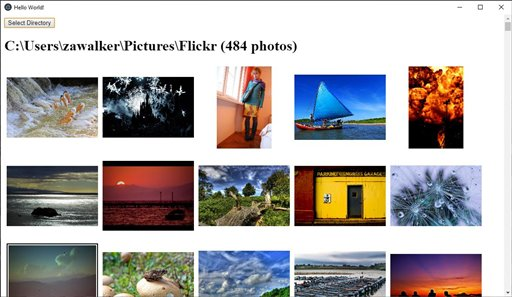

# react-electron-workshop

This repo contains a [react](https://reactjs.org/) [electron](https://electronjs.org/) sample app that we used for a workshop on building react desktop apps with electron. It is a simple app to view photos stored locally on your computer. We use [typescript]( https://www.typescriptlang.org/) because things normally work out better that way.



## To Use
To clone and run this repository, you'll need [Git](https://git-scm.com) and [Node.js](https://nodejs.org/en/download/) (which comes with [npm](http://npmjs.com)) installed on your computer. From your command line:

```
# Clone this repository
git clone https://github.com/miniak/react-electron-workshop.git
# Go into the repository
cd react-electron-workshop
# Install dependencies
npm install
# Build
npm run build
# Run the app
npm start
```

## To make this app step by step

For development we use [vscode](https://code.visualstudio.com/), [Git](https://git-scm.com), [Node.js](https://nodejs.org/en/download/) and [electron-fiddle](https://github.com/electron/fiddle).

### Creating hello world with react, typescript and electron

 * create empty folder: ```mkdir react-photo-viewer``` 
 * go into the folder: ```cd react-photo-viewer``` 
 * Initialize npm: ```npm init```
 * Install electron: ```npm install --save-dev electron```
 * Install react: ```npm install --save react react-dom```
 * Install typescript: ```npm install --save-dev typescript @types/react @types/react-dom```
 * Create [.gitignore](.gitignore) (optional) 
 * Create [tsconfig.json](tsconfig.json)
 * Create src folder: ```mkdir src```
 * Create renderer folder: ```mkdir src/renderer```
 * In the src\renderer folder
 * Create [main.ts](src/main.ts)
 * Create [preload.ts](src/renderer/preload.ts)
 * Create [index.html](src/renderer/index.html)
 * Create [index.tsx](https://github.com/miniak/react-electron-workshop/blob/1314f9d2a09ebeded0040b1b8a23e9e083e04235/src/renderer/index.tsx) (hello world version)
 * Add [index.css](src/renderer/index.css) for styles
 * Add build steps to: [package.json](package.json) and update main ```"main": "src/main.js",```
 * Try to build: ```npm run build```
 * Try to run: ```npm start```
 * :bulb: Try to inspect and debug the render process using developer-tools: <kbd>control</kbd>+<kbd>shift</kbd>+<kbd>I</kbd>
 * :bulb: Try to inspect and [debug the main process](https://electronjs.org/docs/tutorial/debugging-main-process) using chrome://inspect in a seperate chrome instance.
 
 ### Add photo viewing features
 
 * Upgrade [index.tsx](https://github.com/miniak/react-electron-workshop/blob/9876e93bbf3aa0185d3ab6933ea6028fa04a710b/src/renderer/index.tsx) with basic viewer ([diff](https://github.com/miniak/react-electron-workshop/commit/9876e93bbf3aa0185d3ab6933ea6028fa04a710b))
  * :bulb: Note the use of ```remote.app.getPath('pictures')``` and ```fs.readdirSync``` electron api's. This API is only available in the main process – so we access it via [remote](https://github.com/electron/electron/blob/master/docs/api/remote.md).
 
 ### Directory selection
 * Upgrade [index.tsx](https://github.com/miniak/react-electron-workshop/blob/4dd866f7850236b8881abbc998fda1f6fd0f1965/src/renderer/index.tsx) with context menu and thumbnail optimizing ([diff](https://github.com/miniak/react-electron-workshop/commit/4dd866f7850236b8881abbc998fda1f6fd0f1965))
 * :runner: build and run: ```npm run build && npm start```
 
 ### Add context menu 
 * Upgrade [index.tsx](https://github.com/miniak/react-electron-workshop/blob/b3063bf1b1c00cc9fe31e773bf24a27e2d53324d/src/renderer/index.tsx) with context menu and thumbnail optimizing ([diff](https://github.com/miniak/react-electron-workshop/commit/b3063bf1b1c00cc9fe31e773bf24a27e2d53324d))
 * :bulb: Note the use of ```remote.Menu.buildFromTemplate``` electron menu api.
 * :runner: build and run: ```npm run build && npm start```
 
 ### Add exif info
 * Install exif module ```npm install --save exif```
 * Add [popup.html](src/renderer/popup.html) and [popup.tsx](src/renderer/popup.tsx) to display exif info
 * Upgrade [index.tsx](src/renderer/index.tsx) to show exif info ([diff](https://github.com/miniak/react-electron-workshop/commit/19c95f489060a2bd689f55221158620a72094a82))
 * :runner: build and run: ```npm run build && npm start```
 * :bulb: notice an additional rendering process when the exif popup is visible
 
### Packaging the app
 * An app package can be made by just [copying folders](https://electronjs.org/docs/tutorial/application-distribution)
 * But there are packages [packages to do this](https://github.com/electron-userland/electron-packager): ```npm install --save-dev electron-packager```
 * Create the packaged app: ```node_modules\.bin\electron-packager.cmd ./```
 * :bulb: Review the created packaged app folder. Run the packaged app, note it has no native menu. The menu came from the [default app](https://github.com/electron/electron/blob/master/default_app/menu.js).
 
 ### Creating an installer on Windows
 * Install a package to [create an installer](https://github.com/felixrieseberg/electron-wix-msi): ```npm i --save-dev electron-wix-msi```
 * Install [wix toolset](http://wixtoolset.org/)
 * Add wix to the path  ```C:\Program Files (x86)\WiX Toolset v3.11\bin;```
 * Create (make-msi.js)[make-msi.js] with script to create an insaller
 * Build the installer: ```node make-msi.js```
 * :bulb: Install and run
 
 ### Tips
  * Read the [security guide](https://electronjs.org/docs/tutorial/security) **IMPORTANT**
  * We didn't cover [Native Node Modules](https://electronjs.org/docs/tutorial/using-native-node-modules). They provide full access to the native platform – for when electron does not have an api.
  * Electron processes communicate using [IPC](https://electronjs.org/docs/api/ipc-main). It is good to understand potential performance implications.
